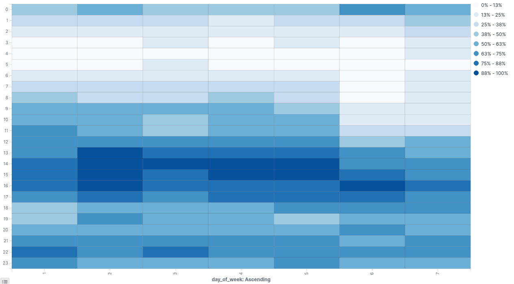

# deezer-stats

Visualize your Deezer listening habbits with this project.

## Feature

Export to an Elasticsearch stack to use Kibana's visualization mecanism.
Use the power of Python to get stats about the most listened artist, song, etc.

## How to use

### Elastic stack

Deploy the local Elasticsearch stack with a simple `docker-compose up -d`
Aims your browser to `localhost:5601` to access Kibana's UI.

### Prepare your data

Get your Deezer data by making a GDPR request to their privacy email, asking
specifically for the whole listening history.

They'll send you a big .xls containing everything. Export the listening history
tab to a TSV file (using google's sprreadsheet, excel or whatever).

The support response may take some time, be careful (legally at most 31 days)

### Run the script

Prepare your python venv, and simply run `./main.py <tsv file>`

### Import pre-built dashboards and vizu

`gunzip export.ndjson.gz` and import the ndjson file in Kibana's UI

# Example

Heatmap of when I listen to music in average during the week.

